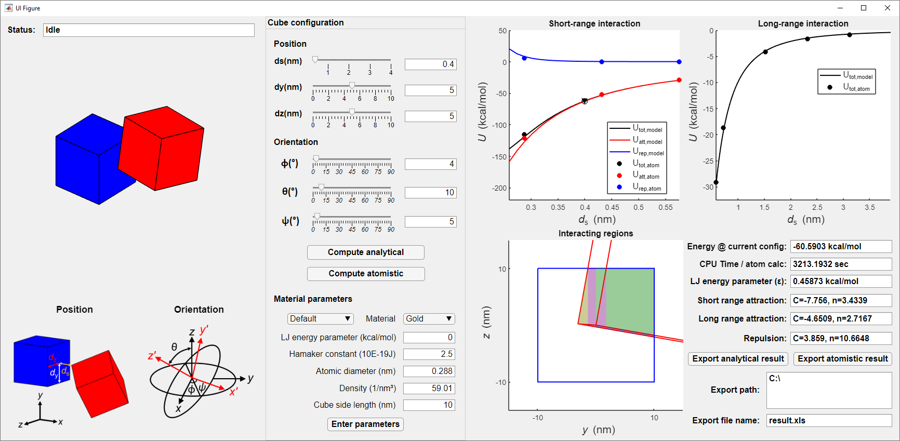

# vdWnano: MATLAB application for computing van der Waals interaction energy between nanocubes.

This software is a MATLAB application that computes the van der Waals interaction energies between nanoscopic cubes in arbitrary configurations. Please see nanocube_vdW_manual.pdf for installation and usage guide.

Please send any questions or comments to: Brian Lee
brian.h.lee@duke.edu

